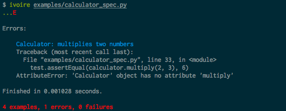

======
Ivoire
======

``ivoire`` is an `RSpec <http://rspec.info/>`_-like testing framework for
Python. It aims to bring a few minor constructs over to Python in a way that
isn't overwhelmingly disruptive or counterculture.

In case you've never heard of RSpec, it's a Ruby
`BDD <http://en.wikipedia.org/wiki/Behavior_driven_development>`_ framework
that is fairly widely used, and whose tests have a style unique from xUnit's.

Installation
------------

Ivoire is on `PyPi <http://pypi.python.org/pypi/ivoire>`_ and can be installed
via ``pip install ivoire`` (or via your preferred installation method).

A Small Example
---------------

``ivoire`` has two modes of operation: standalone mode and transform mode. In
standalone mode, you simply write some tests using ``ivoire.describe`` and then
execute them with the included ``ivoire`` test runner.

Here's an example of what a specification looks like.

.. include:: examples/calculator_spec.py
    :number-lines:
    :code: python

You can find this example at ``examples/calculator_spec.py``, alongside a few
other examples.

After installing Ivoire, running the example above with 
``ivoire examples/calculator_spec.py`` should produce:

Running the Test Suite
----------------------

You can run Ivoire's test suite by running ``tox`` in the root of the
repository checkout, or by running ``YourFavoriteTestRunner ivoire``.

You need to have ``tox`` installed via your package manager or with
``pip install tox`` for the former.

Contributing
------------

I'm Julian Berman.

You can find me on Freenode in ``#python`` and various other channels
(nick: ``tos9``) if you'd like to chat, or if there's enough interest in such a
thing, in ``##ivoire``.

Ivoire is developed on `GitHub <http://github.com/Julian/Ivoire>`_.

Feel free to fork and submit patches or feature requests. Your contributions
are most welcome!

If you'd like the best chance for them to be merged quickly try to include
tests with your pull request, and adhere to general Python coding standards and
your own common sense :).
